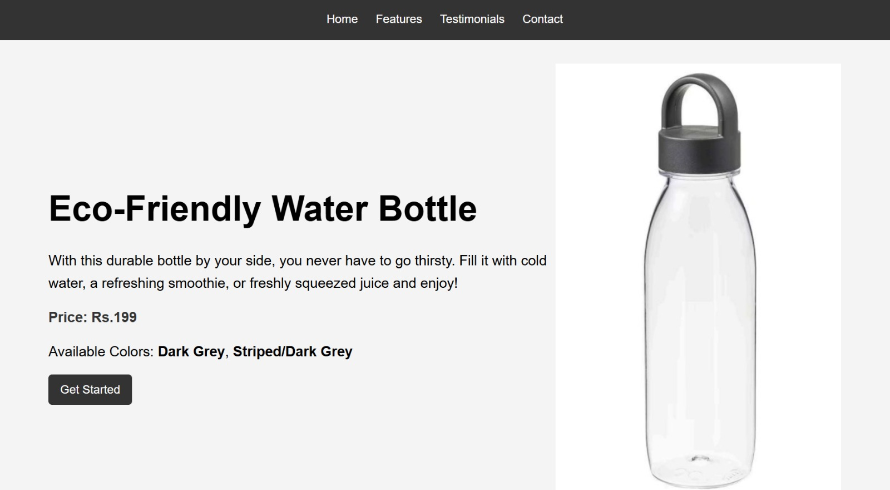
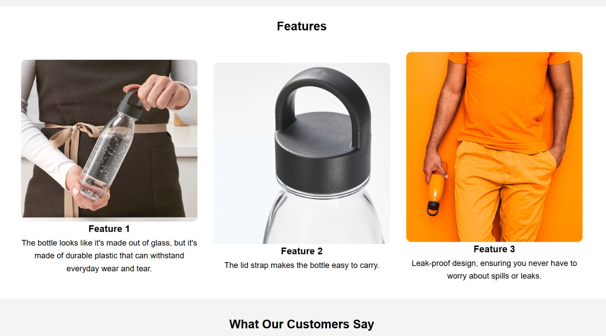
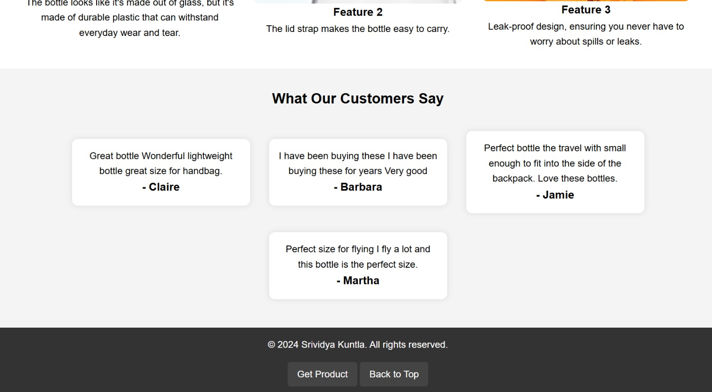

# Eco-Friendly-Water-Bottle-Landing-Page
A responsive product landing page highlighting an eco-friendly water bottle, featuring sections for product details, customer testimonials, and purchase information.  The landing page is built with HTML and CSS, ensuring a clean and attractive presentation on various devices. https://srividya-kuntla.github.io/Eco-Friendly-Water-Bottle-Landing-Page/

## Project Structure

- `index.html`: The main HTML file containing the structure and content of the landing page.
- `styling.css`: The CSS file for styling the landing page.

## Features

- **Hero Section**: Highlights the product with an image, description, price, and available colors.
- **Features Section**: Details the unique features of the water bottle with supporting images.
- **Testimonials Section**: Displays customer reviews and feedback.
- **Footer**: Contains contact information and links to purchase the product and navigate back to the top.

## Screenshots

### Home Section

### Features Section

### Testimonials Section

## Product Link
For more information or to purchase the eco-friendly water bottle, visit the [IKEA product page](https://www.ikea.com/in/en/p/ikea-365-water-bottle-dark-grey-00480014/?utm_source=bing&utm_medium=cpc&utm_campaign=Standard%20Shopping_All%20Products&utm_term=4588055870847128&utm_content=Ad%20group%20%231).

## How to Use

1. Clone or download the repository to your local machine.
2. Open `index.html` in your preferred web browser to view the landing page.

## Responsive Design

- The landing page is designed to be responsive and adjusts to different screen sizes using CSS media queries. 

## License

This project is open-source and available under the MIT License.

## Author

- **Srividya Kuntla** - [GitHub Profile](https://github.com/srividya-kuntla)

